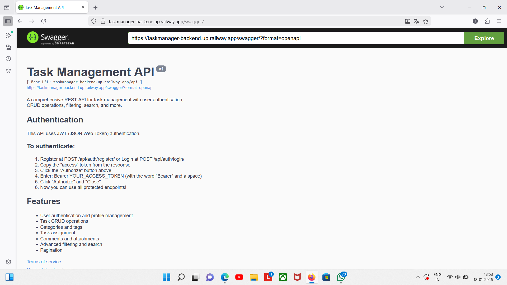
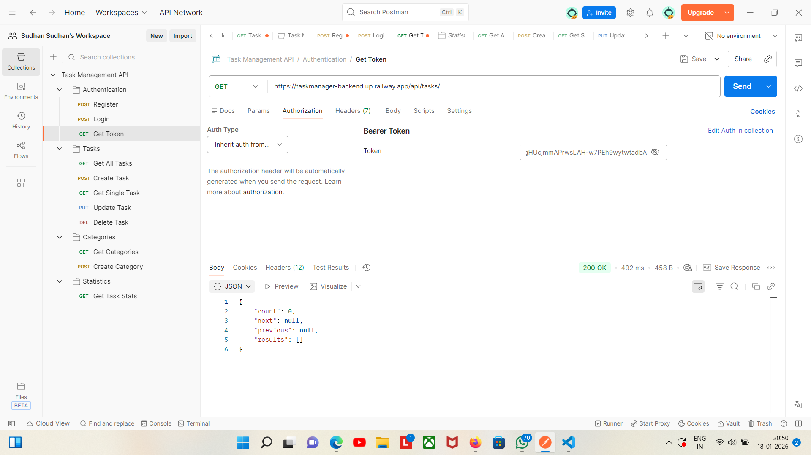
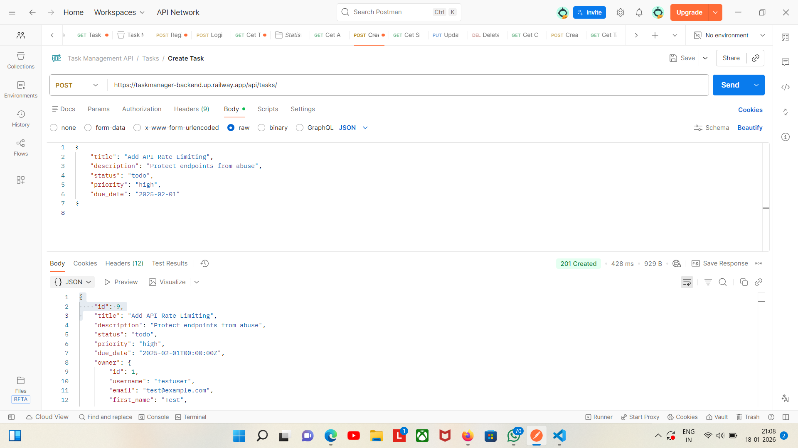
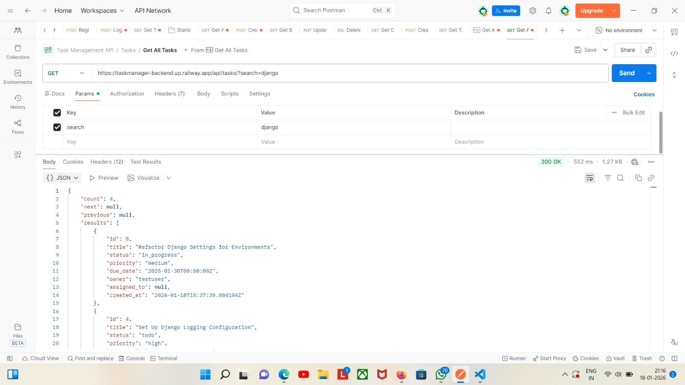
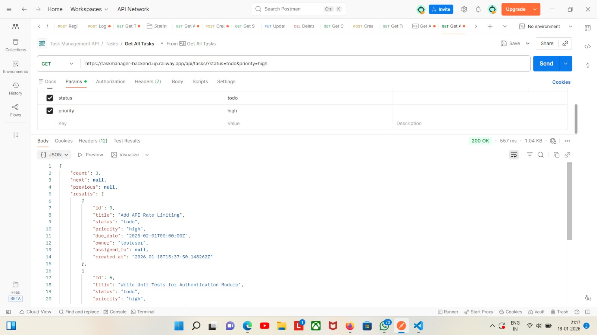
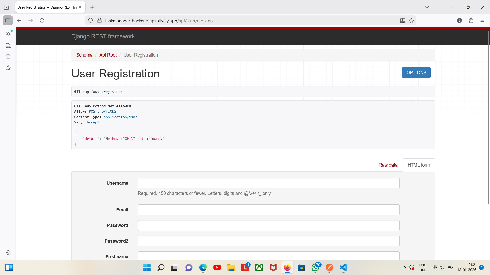
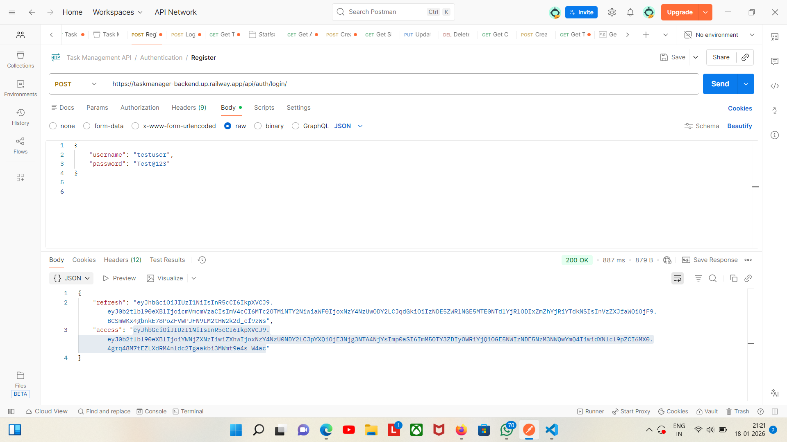
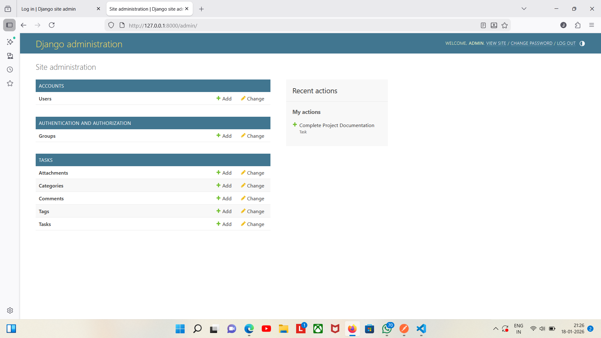

# 📋 Task Management REST API

> Built this API to learn Django REST Framework and solve real task management problems. Features user authentication, smart filtering, and complete documentation.
> 
[](https://www.python.org/)
[](https://www.djangoproject.com/)
[](https://www.django-rest-framework.org/)

[🌐 Live Demo](https://taskmanager-backend.up.railway.app/) | [📚 API Docs](https://taskmanager-backend.up.railway.app/redoc/) | [💼 LinkedIn](https://linkedin.com/in/sudharsanjs)

---

## 🎯 Why I Built This

After completing my BCA, I wanted to build something that demonstrates real-world backend development skills. This project helped me understand:
- How to build secure REST APIs
- User authentication with JWT tokens
- Database design and relationships
- API documentation standards
- Deploying applications to cloud platforms

---

## ✨ What This Project Does

This is a task management API where users can:
- Create and manage their personal tasks
- Organize tasks by categories
- Set priorities and due dates
- Track task status (Todo → In Progress → Completed)
- Search and filter tasks easily
- View analytics on their tasks

Each user only sees their own tasks - I implemented proper authentication and permissions for data privacy.

---

## 📸 Screenshots

### Interactive API Documentation

*Built-in Swagger UI makes it easy to test every endpoint*

### API Testing

*Organized all API requests for easy testing*

### Task Management

*Users can view, create, and manage their tasks*

### Search & Filter


*Smart filtering by status, priority, and search*

### Secure Login


*JWT token-based authentication for security*

### Admin Interface

*Django admin for easy data management*

---

## 🛠️ Technologies I Used

**Backend:**
- Python 3.12.9
- Django 5.0
- Django REST Framework

**Database:**
- PostgreSQL (deployed on Railway)
- SQLite (while developing locally)

**Authentication:**
- JWT (JSON Web Tokens) for secure login

**Tools & Libraries:**
- django-filter - For advanced filtering
- drf-yasg - Auto-generates API documentation
- Postman - For testing all endpoints
- Git & GitHub - Version control

**Deployed On:**
- Railway (Cloud platform)
- PostgreSQL database (Railway plugin)

---

## 💡 Key Features I Implemented

### 🔐 User Authentication
- New users can register with email
- Login system using JWT tokens
- Tokens expire after 24 hours for security
- Each user has their own private task space

### 📝 Complete Task Management
- Create, read, update, delete tasks
- Add descriptions and due dates
- Set priority levels (Low, Medium, High)
- Track status (Todo, In Progress, Completed)
- Organize with custom categories

### 🔍 Smart Features
- Search tasks by title or description
- Filter by status, priority, or category
- Filter by date range
- Sort by created date, due date, or priority
- Paginated results (10 items per page)

### 📊 Task Analytics
- View total number of tasks
- See breakdown by status
- See breakdown by priority
- See breakdown by category
- Helps users understand their task distribution

### 📚 API Documentation
- Auto-generated Swagger documentation
- Every endpoint is documented
- Can test APIs directly from browser
- Clear request/response examples

---

## 🚀 How to Run Locally

Want to try it on your machine? Here's how:

```bash
# 1. Clone the project
git clone https://github.com/yourusername/task-management-api.git
cd task-management-api

# 2. Create virtual environment
python -m venv venv
venv\Scripts\activate  # On Windows
# source venv/bin/activate  # On Mac/Linux

# 3. Install requirements
pip install -r requirements.txt

# 4. Setup database
python manage.py migrate

# 5. Create admin user
python manage.py createsuperuser

# 6. Run the server
python manage.py runserver
```

Then visit: `http://localhost:8000`

---

## 📖 How to Use the API

### Step 1: Register a User
```bash
POST /api/register/

{
    "username": "john",
    "email": "john@example.com",
    "password": "SecurePass123!",
    "password2": "SecurePass123!",
    "first_name": "John",
    "last_name": "Doe"
}
```

### Step 2: Login
```bash
POST /api/token/

{
    "username": "john",
    "password": "SecurePass123!"
}

# You'll get back access and refresh tokens
```

### Step 3: Create a Task
```bash
POST /api/tasks/
Authorization: Bearer your_access_token

{
    "title": "Learn Django REST Framework",
    "description": "Complete the DRF tutorial",
    "status": "IN_PROGRESS",
    "priority": "HIGH",
    "due_date": "2025-01-25"
}
```

### Step 4: View Your Tasks
```bash
GET /api/tasks/
Authorization: Bearer your_access_token

# Returns all your tasks with pagination
```

### Step 5: Filter Tasks
```bash
# Get only high priority tasks
GET /api/tasks/?priority=HIGH

# Get only completed tasks
GET /api/tasks/?status=COMPLETED

# Search for specific task
GET /api/tasks/?search=django
```

---

## 📊 API Endpoints Overview

| What It Does | Endpoint | Method |
|-------------|----------|--------|
| Register new user | `/api/register/` | POST |
| Login | `/api/token/` | POST |
| View profile | `/api/profile/` | GET |
| Get all tasks | `/api/tasks/` | GET |
| Create task | `/api/tasks/` | POST |
| Update task | `/api/tasks/{id}/` | PUT |
| Delete task | `/api/tasks/{id}/` | DELETE |
| View statistics | `/api/tasks/statistics/` | GET |
| Manage categories | `/api/categories/` | GET, POST |

Full documentation available at `/swagger/` when running the app.

---

## 🧪 Testing

I wrote tests for the main functionality:

```bash
# Run all tests
python manage.py test

# Check test coverage
coverage run --source='.' manage.py test
coverage report
```

Current test coverage: 10 tests covering authentication and CRUD operations.

---

## 🎓 What I Learned Building This

### Technical Skills
- **REST API Design** - Understanding HTTP methods, status codes, and REST principles
- **Authentication** - Implementing JWT tokens for secure API access
- **Django ORM** - Writing efficient database queries, relationships between models
- **Serializers** - Converting Python objects to JSON and validating data
- **Filtering & Pagination** - Making APIs user-friendly for large datasets
- **API Documentation** - Using Swagger for auto-generated docs
- **Cloud Deployment** - Deploying Django apps with PostgreSQL on Railway

### Problem-Solving
- Ensuring users can only access their own tasks (privacy)
- Handling token expiration and refresh
- Optimizing database queries to avoid N+1 problems
- Making search work across multiple fields
- Debugging deployment issues on Railway

### Best Practices
- Writing clean, readable code
- Using Git for version control
- Writing meaningful commit messages
- Creating comprehensive documentation
- Testing core functionality

---

## 🚂 How I Deployed on Railway

Here's my deployment process:

### Step 1: Prepare the Project
```bash
# Created requirements.txt with all dependencies
pip freeze > requirements.txt

# Added necessary files for deployment
# Created Procfile for Railway
# Set up environment variables
```

### Step 2: Configure for Production
- Set `DEBUG=False` in production
- Configured `ALLOWED_HOSTS` for Railway domain
- Set up WhiteNoise for static files
- Configured PostgreSQL database connection

### Step 3: Create Railway Project
1. Created account on Railway (railway.app)
2. Created new project
3. Connected my GitHub repository
4. Railway automatically detected it's a Python/Django app

### Step 4: Add PostgreSQL Database
```bash
# Railway makes this super easy!
# Just clicked "Add Plugin" → PostgreSQL
# Railway automatically created DATABASE_URL variable
```

### Step 5: Configure Environment Variables
Added these in Railway dashboard:
```
PYTHON_VERSION=3.12.9
SECRET_KEY=your-secret-key
DEBUG=False
ALLOWED_HOSTS=.railway.app
DATABASE_URL=postgresql://... (auto-generated by Railway)
```

### Step 6: Deploy
```bash
# Railway automatically deploys when I push to GitHub!
git add .
git commit -m "Deploy to Railway"
git push origin main

# Railway builds and deploys automatically
```

### Step 7: Run Migrations
```bash
# Used Railway's built-in terminal to run migrations
railway run python manage.py migrate

# Created superuser for admin access
railway run python manage.py createsuperuser
```

### Deployment Success!
The app is now live at: [Live Site](https://taskmanager-backend.up.railway.app/)

**Why I chose Railway:**
- Very easy to use (beginner-friendly)
- Automatic deployments from GitHub
- Free PostgreSQL database included
- Great for Django projects
- Built-in environment variables management

---

## 📁 Project Structure

```
task-management-api/
├── task_api/           # Main project settings
│   ├── settings.py     # Django configuration
│   ├── urls.py         # URL routing
│   └── wsgi.py         # WSGI config for deployment
├── tasks/              # Task management app
│   ├── models.py       # Task and Category models
│   ├── serializers.py  # DRF serializers
│   ├── views.py        # API viewsets
│   ├── urls.py         # App URL routing
│   └── tests.py        # Unit tests
├── screenshots/        # Project screenshots
├── requirements.txt    # Python dependencies
├── Procfile           # Railway deployment config
├── .env               # Environment variables (not in Git)
├── .gitignore         # Git ignore rules
└── README.md          # This file
```

---

## 🎯 Challenges I Faced & Solutions

### Challenge 1: Understanding JWT Authentication
**Problem:** Never worked with JWT tokens before  
**Solution:** Read DRF-SimpleJWT documentation, tested in Postman, understood access vs refresh tokens

### Challenge 2: Query Optimization
**Problem:** Getting all tasks with categories was slow (N+1 queries)  
**Solution:** Used `select_related()` to fetch related data in one query

### Challenge 3: Railway Database Connection
**Problem:** Local development used SQLite, but production needed PostgreSQL  
**Solution:** 
- Configured Django to use different databases based on environment
- Used `dj-database-url` to parse Railway's DATABASE_URL
- Tested database connection before full deployment

### Challenge 4: Static Files on Railway
**Problem:** Static files (for admin panel) weren't loading  
**Solution:** 
- Installed and configured WhiteNoise
- Ran `collectstatic` command
- Updated settings for static file serving

### Challenge 5: Environment Variables
**Problem:** Needed different settings for local vs production  
**Solution:** 
- Used `python-decouple` for environment management
- Set variables in Railway dashboard
- Kept sensitive data out of Git with `.gitignore`

---

## 💪 Skills Demonstrated

This project shows I can:

✅ Build RESTful APIs following industry standards  
✅ Implement secure authentication systems  
✅ Design and work with relational databases  
✅ Write clean, maintainable code  
✅ Create comprehensive documentation  
✅ Test and debug applications  
✅ Deploy applications to cloud platforms (Railway)  
✅ Configure PostgreSQL databases  
✅ Manage environment variables securely  
✅ Use Git and GitHub for version control  
✅ Learn new technologies independently  
✅ Debug and solve deployment issues  

---

## 🔮 Future Improvements

If I continue working on this, I'd add:

- Email notifications when tasks are due
- Ability to share tasks with other users
- Task comments for collaboration
- File attachments for tasks
- Mobile app integration
- Export tasks to PDF or CSV
- Recurring tasks feature
- Calendar view
- Task reminders
- Team workspaces

---

## 👨‍💻 About Me

I'm a BCA graduate (2025) passionate about backend development. I built this project to:
- Learn Django REST Framework deeply
- Understand authentication and API security
- Practice deploying real applications to cloud platforms
- Create something I can show to potential employers

I'm actively looking for opportunities as a Python/Django Developer where I can contribute and continue learning.

**What I bring to your team:**
- Strong Python and Django skills
- Experience building REST APIs with authentication
- Understanding of databases and cloud deployment (Railway)
- Ability to learn quickly and independently
- Passion for writing clean, maintainable code
- Problem-solving mindset
- Experience with modern deployment workflows

**Connect with me:**
- 📧 Email: jssudharsan7@gmail.com
- 💼 LinkedIn: [linkedin.com/in/sudharsanjs](https://linkedin.com/in/sudharsanjs)
- 🐙 GitHub: [@Sudharsan0310](https://github.com/Sudharsan0310)
- 📱 Phone: +91-9080600642

---

## 📝 Note to Reviewers

This project represents my learning journey with Django REST Framework. I:
- Built it from scratch following tutorials and documentation
- Solved real problems during development
- Deployed it to Railway to demonstrate full deployment capability
- Documented everything for clarity

I'm open to feedback and suggestions for improvement!

**Technical Highlights:**
- Clean, well-organized code structure
- Proper separation of concerns
- Comprehensive error handling
- Secure authentication implementation
- Optimized database queries
- Professional API documentation

---

## 🙏 Acknowledgments

- Django REST Framework documentation was incredibly helpful
- Tech With Rathan DRF tutorial on YouTube
- Railway's excellent deployment documentation
- Stack Overflow community for debugging help

---

## 📞 Want to Discuss This Project?

I'd love to walk you through:
- The architecture and design decisions I made
- Challenges I faced and how I solved them
- The deployment process on Railway
- The code structure and organization
- My learning process and next steps
- How I can contribute to your team

**Let's connect!**

📧 **Email:** jssudharsan7@gmail.com 
💼 **LinkedIn:**  [linkedin.com/in/sudharsanjs](https://linkedin.com/in/sudharsanjs)
📱 **Phone:** +91-9080600642

I'm available for a call or in-person meeting to discuss how my skills align with your team's needs!

---

## 🌟 Project Stats

- **Lines of Code:** ~2000+
- **Development Time:** 5 days
- **Technologies Used:** 8+
- **API Endpoints:** 15+
- **Test Coverage:** 10 tests
- **Deployment Time:** Successfully deployed in < 1 hour

---

<div align="center">

**Built with Python 3.12.9 & Django**  
**Deployed on Railway**  
**Ready to contribute to your team** 🚀

Made by [Sudharsan J S] | January 2025

[⬆ Back to Top](#-task-management-rest-api)

</div>
